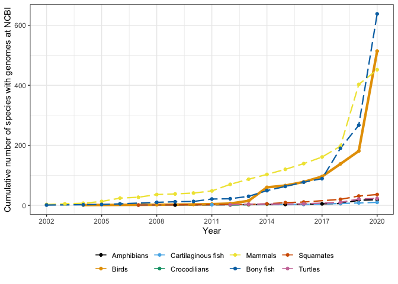
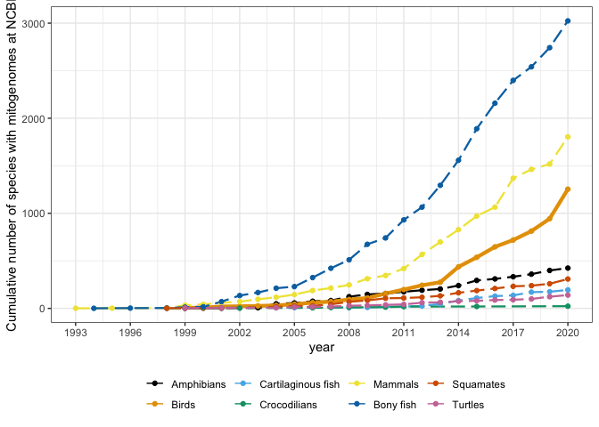
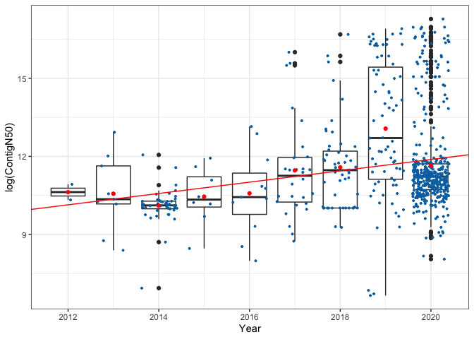
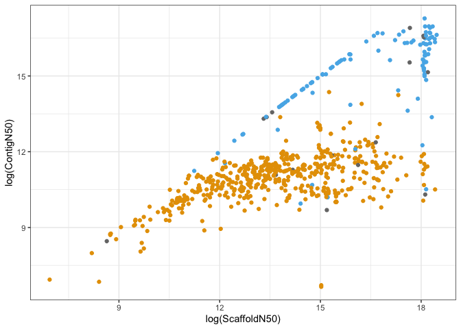

What have we learned from the first 500 avian genomes? <br> Annu.
Rev. Ecol. Syst. Evol
================
G. A. Bravo, C. J. Schmitt, S. V. Edwards
01/05/2021

<style type="text/css">

body{ /* Normal  */
      font-size: 14px;
  }
td {  /* Table  */
  font-size: 10px;
}
h1.title {
  font-size: 22px;
  color: DarkBlue;
  font-family: Arial, Helvetica, sans-serif;
}
h1 { /* Header 1 */
  font-size: 18px;
  font-weight: bold;
  font-family: Arial, Helvetica, sans-serif;
}
h2 { /* Header 2 */
  font-size: 16px;
  font-family: Arial, Helvetica, sans-serif;
  font-style: oblique;
}
h3 { /* Header 3 */
  font-size: 14px;
  font-family: Arial, Helvetica, sans-serif;
  font-style: oblique;
}
code.r{ /* Code block */
    font-size: 14px;
    font-family: Arial, Helvetica, sans-serif;
    font-stretch: expanded;
}
pre { /* Code block - determines code spacing between lines */
    font-size: 14px;
    font-family: Arial, Helvetica, sans-serif;
}
</style>

# **This script creates summary plots of the associated information from genomes housed at NCBI**

**Nuclear Genomes**

There are three separate tables for each **group** (aves,
amphibia,choncrichthyes, crocodylia, mammalia, osteichthyes, squamata,
testudines):

1.  NCBI\_**group**\_Genomes\_04Jan2021.csv: Table containing general
    information for whole nuclear genomes \[04 January 2020 -
    <https://www.ncbi.nlm.nih.gov/genome/browse/#!/eukaryotes/>\]

These files were merged into **NCBI\_all\_Genomes\_04Jan2021.csv**

2.  NCBI\_AssemblyData.csv\_**group**\_04Jan2021.csv: Table containing
    ContigN50 and ScaffoldN50 \[04 January 2020 -
    <https://www.ncbi.nlm.nih.gov/assembly/> - with search parameter
    just the name of the vertebrate class\] For birds, information about
    sequencing technology was extracted from assembly reports.

These files were merged into **NCBI\_AssemblyData\_all\_04Jan2021.csv**

**Mitogenomes**

There are three separate tables for each **group** (aves,
amphibia,choncrichthyes, crocodylia, mammalia, osteichthyes, squamata,
testudines):

3.  NCBI\_mitogenomes\_**group**\_03Jan2021.csv: Table containing
    information for mitogenomes \[03 January 2021 -
    <https://www.ncbi.nlm.nih.gov/nuccore/> - with the following search
    criteria: “\[taxon\_name\] mitochondrion genome” and selecting the
    following filters on the far left panel: Genetic Compartments =
    Mitochondrion and Sequence Length = 15500-30000\]

These files were merged into
**NCBI\_mitogenomes\_all\_03Jan2021.csv**

# 1\. Setting working directory and loading packages:

``` r
setwd("~/Dropbox/AREES_review_2020/R_AREES_review_2020/bird_genomics_review/genome_stats_figure/")
library(tidyverse)
library(knitr)
library(scales)
library(ggthemes)
```

# 2\. Reading Data

``` r
genomes <- tbl_df(read.csv("NCBI_all_Genomes_04Jan2021.csv", header = T)) 
mitogenomes <- tbl_df(read.csv("NCBI_mitogenomes_all_03Jan2021.csv", header = T))
assembly_stats <- tbl_df(read.csv("NCBI_AssemblyData_all_04Jan2021.csv", header = T)) 
```

# 3\. Cumulative number of genomes per year

``` r
genomes_by_year <- genomes %>% group_by(X.Organism.Name) %>% filter(ReleaseOrder==min(ReleaseOrder)) %>% group_by(Year,Organism.Groups) %>% tally() %>% group_by(Organism.Groups) %>% mutate(cum=cumsum(n))

breaks <- seq(2002,2020,by=3)
#show_col(colorblind_pal()(8))
plot_genomes_year <- ggplot(genomes_by_year, aes(x=Year, y=cum)) +
  geom_line(aes(color=Organism.Groups,size=Organism.Groups, linetype=Organism.Groups)) +
  scale_linetype_manual(values=c(Amphibia = "longdash", Aves = "solid", Chondrichthyes= "longdash", Crocodylia = "longdash", Mammalia = "longdash", Osteichthyes = "longdash", Squamata = "longdash", Testudines = "longdash")) +
  scale_size_manual(values=c(Amphibia = 0.8, Aves = 1.5, Chondrichthyes = 0.8, Crocodylia = 0.8, Mammalia = 0.8, Osteichthyes = 0.8, Squamata = 0.8, Testudines = 0.8)) +
  geom_point(aes(color=Organism.Groups)) +
  scale_color_colorblind(labels=c("Amphibians","Birds","Cartilaginous fish", "Crocodilians", "Mammals", "Bony fish", "Squamates", "Turtles")) +
  scale_x_continuous(breaks=breaks) +
  theme_bw() +
  theme(legend.position = "bottom",legend.title = element_blank()) +
  guides(size = FALSE, linetype = FALSE) +
  ylab("Cumulative number of species with genomes at NCBI") 
plot_genomes_year
```

<!-- -->

# 4\. Cumulative number of mitogenomes per year

``` r
mitogenomes_by_year <- mitogenomes %>% group_by(organism) %>% filter(ReleaseOrder==min(ReleaseOrder)) %>% group_by(year,Organism.Groups) %>% tally() %>% group_by(Organism.Groups) %>% mutate(cum=cumsum(n))

breaks <- seq(1990,2020,by=3)
plot_mitogenomes_year <- ggplot(mitogenomes_by_year, aes(x=year, y=cum)) +
  geom_line(aes(color=Organism.Groups,size=Organism.Groups, linetype=Organism.Groups)) +
  scale_linetype_manual(values=c(Amphibia = "longdash", Aves = "solid", Chondrichthyes= "longdash", Crocodylia = "longdash", Mammalia = "longdash", Osteichthyes = "longdash", Squamata = "longdash", Testudines = "longdash")) +
  scale_size_manual(values=c(Amphibia = 0.8, Aves = 1.5, Chondrichthyes=0.8, Crocodylia=0.8, Mammalia = 0.8, Osteichthyes=0.8, Squamata = 0.8, Testudines = 0.8)) +
  geom_point(aes(color=Organism.Groups)) +
  scale_color_colorblind(labels=c("Amphibians","Birds","Cartilaginous fish", "Crocodilians", "Mammals", "Bony fish", "Squamates", "Turtles")) +
  scale_x_continuous(breaks=breaks) +
  theme_bw() +
  theme(legend.position = "bottom",legend.title = element_blank()) +
  guides(size = FALSE, linetype = FALSE) +
  ylab("Cumulative number of species with mitogenomes at NCBI") 
plot_mitogenomes_year
```

<!-- -->

# 5\. Contig N50 per year across avian assemblies

``` r
genome_stats_aves <- assembly_stats %>% filter(Organism.Groups == "Aves")
coefs_C50 <- coef(lm(log(ContigN50) ~ SubmissionYear, data = genome_stats_aves))

plot_contigN50_year <- ggplot(genome_stats_aves, aes(x=SubmissionYear, y=log(ContigN50), group = SubmissionYear)) +
  geom_boxplot() +
  geom_jitter(size =0.7, color = "#0072B2") +
  theme_bw() +
  xlab("Year") +
  ylab("log(ContigN50)") +
  geom_abline(intercept = coefs_C50[1], slope = coefs_C50[2], color = "red") +
  stat_summary(fun = mean, color="red", geom = "point")
plot_contigN50_year
```

<!-- -->

# 6\. Scaffold N50 vs Contig N50 across avian assemblies

``` r
plot_scaffoldN50_contigN50_year <- ggplot(genome_stats_aves, aes(x=log(ScaffoldN50), y=log(ContigN50), color=long_reads)) +
  geom_point() +
  scale_color_manual(values = c("#E69F00","#56B4E9"),na.value = "#767676") +
  theme_bw() +
  xlab("log(ScaffoldN50)") +
  ylab("log(ContigN50)") +
  theme(legend.position = "none") +
  guides(color=guide_legend("Use of long reads"))
plot_scaffoldN50_contigN50_year
```

<!-- -->
